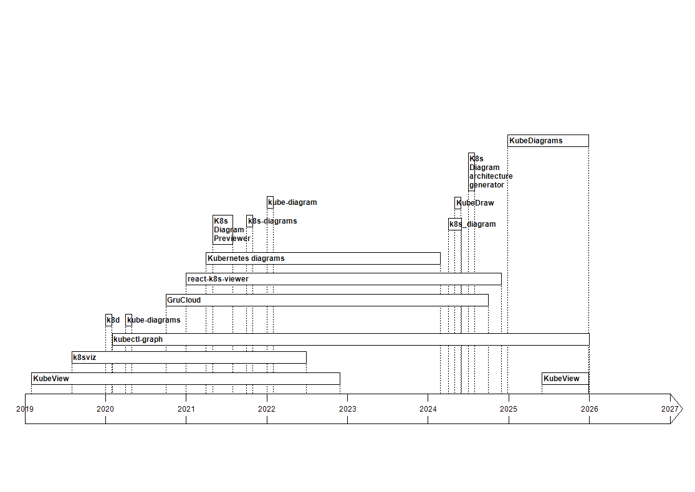

# Awesome Kubernetes Architecture Diagrams

## Kubernetes Icons Set (KIS)

* [Kubernetes Icons Set](https://github.com/kubernetes/community/tree/master/icons) provides icons to standardize Kubernetes architecture diagrams for presentation. Having uniform architecture diagrams improve understandibility.

## Drawing Tools

* **CloudSkew**: [https://www.cloudskew.com](https://www.cloudskew.com)

* **Creately**: [https://creately.com](https://creately.com)

* **Draw.io**: [https://www.drawio.com](https://www.drawio.com)

* **Holori**: [https://holori.com/kubernetes-diagram-tool/](https://holori.com/kubernetes-diagram-tool/)

* **Hyperglance**: [https://www.hyperglance.com/platforms/kubernetes/](https://www.hyperglance.com/platforms/kubernetes/)

* **Layer5**: [https://layer5.io/cloud-native-management/generate-kubernetes-architecture-diagram](https://layer5.io/cloud-native-management/generate-kubernetes-architecture-diagram)

* **Lucidchart**: [https://www.lucidchart.com](https://www.lucidchart.com)

* **Moqups**: [https://moqups.com/templates/mapping-and-diagramming/network-diagrams/kubernetes-diagram/](https://moqups.com/templates/mapping-and-diagramming/network-diagrams/kubernetes-diagram/)

* **Terrastruct**: [https://terrastruct.com](https://terrastruct.com)

* a lot of others!

## Diagrams as Code

* **Diagrams**: [https://github.com/mingrammer/diagrams](https://github.com/mingrammer/diagrams)
  * Diagram as Code for prototyping cloud system architectures
  * Popularity: 
  * Activity:
    * 
    * 
    * 
    * 
  * Implementation: Python
  * Most of Kubernetes resources supported

* **Diagrams as code**: [https://github.com/dmytrostriletskyi/diagrams-as-code](https://github.com/dmytrostriletskyi/diagrams-as-code)
  * Declarative configurations using YAML for drawing cloud system architectures
  * Popularity: 
  * Activity:
    * 
    * 
    * 
    * 
  * Implementation: Python with Diagrams
  * Most of Kubernetes resources supported

* **Kubernetes-PlantUML**: [https://github.com/dcasati/kubernetes-PlantUML](https://github.com/dcasati/kubernetes-PlantUML)
  * PlantUML sprites, macros and stereotypes for creating PlantUML diagrams with the Kubernetes components
  * Popularity: 
  * Activity:
    * 
    * 
    * 
    * 
  * Implementation: PlantUML
  * Most of Kubernetes resources supported

* a few others!

## Generation Tools

* **KubeView**: [https://github.com/benc-uk/kubeview](https://github.com/benc-uk/kubeview)
  * Kubernetes cluster visualiser and graphical explorer
  * Popularity: 
  * Activity:
    * 
    * 
    * 
    * 
  * Implementation: Vue and Go
  * Input formats: K8s API
  * Supported Kubernetes resources
    * Deployment
    * ReplicaSet
    * StatefulSet
    * DaemonSet
    * Pod
    * Service
    * Ingress
    * PersistentVolumeClaim
    * Secret
    * ConfigMap
  * KIS supported
  * Output formats: Web pages

* **KubeDiagrams**: [https://github.com/philippemerle/KubeDiagrams](https://github.com/philippemerle/KubeDiagrams)
  * Generate Kubernetes architecture diagrams from Kubernetes manifest files, kustomization files, Helm charts, and actual cluster state. The main originality of KubeDiagrams is its configurability allowing for instance to deal with custom Kubernetes resources.
  * Popularity: 
  * Activity:
    * 
    * 
    * 
    * 
  * Implementation: Python with Diagrams
  * Input formats: K8s manifests, kustomization files, Helm charts, and K8s API
  * 47 Kubernetes resource kinds supported
  * KIS supported
  * Output formats: PNG, JPG, SVG, PDF, and DOT

* **k8sviz**: [https://github.com/mkimuram/k8sviz](https://github.com/mkimuram/k8sviz)
  * Generate Kubernetes architecture diagrams from the actual state in a namespace
  * Popularity: 
  * Activity:
    * 
    * 
    * 
    * 
  * Implementation: Go and Graphviz
  * Input formats: K8s API
  * Supported Kubernetes resources
    * Namespace
    * Service
    * PersistentVolumeClaim
    * Pod
    * StatefulSet
    * DaemonSet
    * ReplicaSet
    * Deployment
    * Job
    * CronJob
    * Ingress
    * HorizontalPodAutoscaler
  * KIS supported
  * Output formats: [all Graphviz output formats](https://graphviz.org/docs/outputs/)

* **Kubernetes diagrams**: [https://github.com/trois-six/k8s-diagrams](https://github.com/trois-six/k8s-diagrams)
  * Create diagrams from the Kubernetes API with go-diagrams
  * Popularity: 
  * Activity:
    * 
    * 
    * 
    * 
  * Implementation: Go
  * Input formats: K8s API
  * Supported Kubernetes resources
    * Namespace
    * Deployment
    * ReplicaSet
    * DaemonSet
    * StatefulSet
    * Pod
    * Service
    * Ingress
  * KIS supported
  * Output formats: DOT only

* **GruCloud**: [https://github.com/grucloud/grucloud](https://github.com/grucloud/grucloud)
  * Generate code and diagrams from cloud infrastructures: AWS, Azure, GCP, Kubernetes
  * Popularity: 
  * Activity:
    * 
    * 
    * 
    * 
  * Implementation: JavaScript
  * Input formats: JavaScript IaC
  * Supported Kubernetes resources
    * ConfigMap
    * ClusterRole
    * ClusterRoleBinding
    * Deployment
    * Ingress
    * Namespace
    * PersistentVolume
    * PersistentVolumeClaim
    * Secret
    * Role
    * RoleBinding
    * Service
    * Service Account
    * StatefulSet
  * KIS unsupported
  * Output formats: PlantUML

* **K8s Diagram architecture generator**: [https://github.com/kocierik/k8s-to-diagram](https://github.com/kocierik/k8s-to-diagram)
  * Generate a diagram architecture from kubernetes manifests
  * Popularity: 
  * Activity:
    * 
    * 
    * 
    * 
  * Implementation: Go and D2
  * Input formats: K8s manifest annotations
  * Supported Kubernetes resources
    * Deployment
    * Service
    * Pod
    * ConfigMap
    * Secret
    * Ingress
    * StatefulSet
    * PersistentVolume
    * PersistentVolumeClaim
  * KIS unsupported
  * Output formats: SVG and PNG

* **react-k8s-viewer**: [https://github.com/SocialGouv/react-k8s-viewer](https://github.com/SocialGouv/react-k8s-viewer)
  * Render diagrams from your kubernetes manifests
  * Popularity: 
  * Activity:
    * 
    * 
    * 
    * 
  * Implementation: TypeScript
  * Input formats: K8s manifests
  * 7 Kubernetes resource kinds supported
  * KIS unsupported
  * Output formats: React Flow

* **K8s Diagram Previewer**: [https://github.com/jimmymills/k8s-diagram-previewer](https://github.com/jimmymills/k8s-diagram-previewer)
  * Diagram generator for Kubernetes manifests
  * Popularity: 
  * Activity:
    * 
    * 
    * 
    * 
  * Implementation: Python with Diagrams
  * Input formats: K8s manifests and Helm charts
  * Supported Kubernetes resources
    * Deployment
    * Service
    * Ingress
    * Pod
    * CronJob
    * Job
    * DaemonSet
    * StatefulSet
    * ConfigMap
    * Secret
    * PersistentVolumeClaim
  * KIS supported
  * Output formats: PNG, JPG, SVG, PDF, and DOT

* **k8s-diagrams**: [https://github.com/imjoseangel/k8s-diagrams](https://github.com/imjoseangel/k8s-diagrams)
  * Creates graphviz diagrams from the Kubernetes API
  * Popularity: 
  * Activity:
    * 
    * 
    * 
    * 
  * Implementation: Python with Diagrams
  * Input formats: K8s API
  * Supported Kubernetes resources
    * Namespace
    * Deployment
    * Pod
    * ReplicaSet
    * HorizontalPodAutoscaler
    * Ingress
    * Service
    * Endpoint
  * KIS supported
  * Output formats: PNG, JPG, SVG, PDF, and DOT

* **kube-diagram**: [https://github.com/kahowell/kube-diagram](https://github.com/kahowell/kube-diagram)
  * Experimental cli tool to generate plantuml diagrams of k8s/openshift resources
  * Popularity: 
  * Activity:
    * 
    * 
    * 
    * 
  * Implementation: Java
  * Input formats: K8s manifests
  * Few Kubernetes resources supported
  * Unknown if KIS supported
  * Output formats: Unknown

* **kube-diagrams**: [https://github.com/sunny10031982/kube-diagrams](https://github.com/sunny10031982/kube-diagrams)
  * Generate Kubernetes diagrams
  * Popularity: 
  * Activity:
    * 
    * 
    * 
    * 
  * Implementation: Python with Diagrams
  * Input formats: K8s API
  * Supported Kubernetes resources
    * Ingress
    * Service
    * Pod
  * KIS supported
  * Output formats: PNG

* **k8d**: [https://github.com/NickSchleicher/k8d](https://github.com/NickSchleicher/k8d)
  * Diagram Kubernetes Network Policies
  * Popularity: 
  * Activity:
    * 
    * 
    * 
    * 
  * Implementation: Go
  * Input formats: K8s API
  * Supported Kubernetes resources
    * NetworkPolicy
    * Pod
  * Unknown if KIS supported
  * Output formats: XML for draw.io

* **k8s_diagram**: [https://github.com/MrSir/k8s_diagram](https://github.com/MrSir/k8s_diagram)
  * A simple package to generate mermaid.js diagram of your Kubernetes Cluster
  * Popularity: 
  * Activity:
    * 
    * 
    * 
    * 
  * Implementation: Python
  * Input formats: K8s API
  * Kubernetes resources supported
    * Pod
    * Job
    * CronJob
    * StatefulSet
    * ReplicaSet
    * Deployment
    * Service
    * Namespace
  * KIS supported
  * Output formats: PNG

* **KubeDraw**: [https://github.com/B0nam/kubedraw](https://github.com/B0nam/kubedraw)
  * A Python-based tool designed to simplify the visualization of Kubernetes infrastructure
  * Popularity: 
  * Activity:
    * 
    * 
    * 
    * 
  * Implementation: Python with Diagrams
  * Input formats: K8s API
  * Kubernetes resources supported
    * Deployment
    * Pod
    * Ingress
    * Service
    * Namespace
  * KIS supported
  * Output formats: PNG

* **Kubeviz**: [https://www.bitfoundry.co/visualizing-kubernetes-manifests-and-helm-chart-with-kubeviz/](https://www.bitfoundry.co/visualizing-kubernetes-manifests-and-helm-chart-with-kubeviz/)
  * A Web app to visualize your Kubernetes installation, helm chart, manifest without installation
  * Popularity: no data available
  * Activity: no data available
  * Implementation: Diagrams
  * Input formats: K8s manifests and Helm charts
  * Kubernetes resources supported
    * Ingress
    * Service
    * Deployment
    * Pod
    * Job
    * Cronjob
    * DaemonSet
    * ConfigMap
    * Secret
  * KIS supported
  * Output formats: PNG

### Comparison Table

| Tool | K8s Kinds | Activity | Popularity |
| :--------: | :-------: | :-------: | :-------: |
| **[KubeView](https://github.com/benc-uk/kubeview)** | **10** |    |  |
| **[KubeDiagrams](https://github.com/philippemerle/KubeDiagrams)** | **47+** |    |  |
| **[k8sviz](https://github.com/mkimuram/k8sviz)** | **12** |    |  |
| **[Kubernetes diagrams](https://github.com/trois-six/k8s-diagrams)** | **8** |    |   |
| **[GruCloud](https://github.com/grucloud/grucloud)** | **14** |    |  |
| **[K8s Diagram architecture generator](https://github.com/kocierik/k8s-to-diagram)** | **9** |    |  |
| **[react-k8s-viewer](https://github.com/SocialGouv/react-k8s-viewer)** | **7** |    |  |
| **[K8s Diagram Previewer](https://github.com/jimmymills/k8s-diagram-previewer)** | **11** |    |  |
| **[k8s-diagrams](https://github.com/imjoseangel/k8s-diagrams)** | **8** |    |  |
| **[kube-diagram](https://github.com/kahowell/kube-diagram)** | **5** |    |  |
| **[kube-diagrams](https://github.com/sunny10031982/kube-diagrams)** | **3** |    |  |
| **[k8d](https://github.com/NickSchleicher/k8d)** | **2** |    |  |
| **[k8s_diagram](https://github.com/MrSir/k8s_diagram)** | **8** |    |  |
| **[KubeDraw](https://github.com/B0nam/kubedraw)** | **5** |    |  |
| **[Kubeviz](https://www.bitfoundry.co/visualizing-kubernetes-manifests-and-helm-chart-with-kubeviz/)** | **9** | no data | no data |

### Popularity History

### Activity Timeline

## Various Other Resources

* **k8s-diagrams**: [https://github.com/cloudogu/k8s-diagrams](https://github.com/cloudogu/k8s-diagrams)
  * A collection of diagrams explaining Kubernetes
  * Popularity: 
  * Activity:
    * 
    * 
    * 
    * 

* **Hari Sekhon - Diagrams-as-Code**: [https://github.com/HariSekhon/Diagrams-as-Code](https://github.com/HariSekhon/Diagrams-as-Code)
  * Cloud & DevOps Architecture Diagrams-as-Code in Python and D2 languages
  * Popularity: 
  * Activity:
    * 
    * 
    * 
    * 
  * Implementation: D2 and Python with Diagrams
  * Most of Kubernetes resources supported

* **Drawing your Kubernetes cluster the right way**: [https://archive.fosdem.org/2023/schedule/event/container_kubernetes_cluster_right_way/attachments/slides/5304/export/events/attachments/container_kubernetes_cluster_right_way/slides/5304/kda_FOSDEM_2023_k8s.pdf](https://archive.fosdem.org/2023/schedule/event/container_kubernetes_cluster_right_way/attachments/slides/5304/export/events/attachments/container_kubernetes_cluster_right_way/slides/5304/kda_FOSDEM_2023_k8s.pdf)

* [Visualizing Kubernetes with Generated Diagrams](https://www.youtube.com/watch?v=GEeodHEOmvA), talk at Southern California Linux Expo

* [Visualizing Kubernetes Distributed Systems: An Exploratory Study](https://ieeexplore.ieee.org/document/10350136), D. G. Balreira, T. da Silva Araújo and F. Petrillo, 2023 IEEE Working Conference on Software Visualization (VISSOFT), Bogotá, Colombia, 2023, pp. 12-22, doi: 10.1109/VISSOFT60811.2023.00011.

* [Cloud architecture tools](https://cloudarchitecture.tools/)
